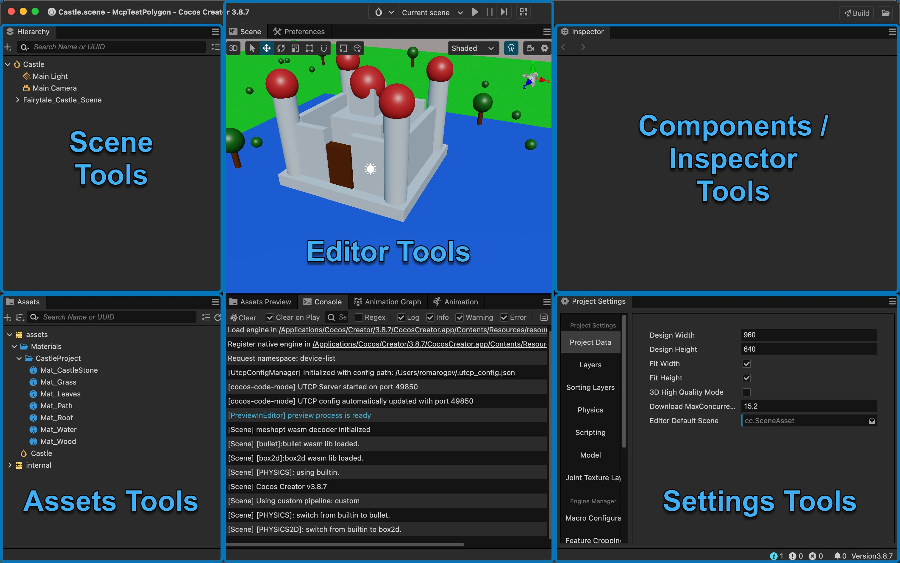

# Code Mode for Cocos Creator

**Code Mode** turns the Cocos Creator Editor into an AI-controllable tool. It runs an HTTP server inside the editor that exposes scene manipulation, asset management, and property inspection as structured tool calls via [UTCP Protocol](https://www.utcp.io/) — letting AI agents build, inspect, and modify Cocos Creator projects the same way a developer would through the UI.
These tools are combined in [UTCP Code Mode](https://github.com/universal-tool-calling-protocol/code-mode/) environment to achieve maximum performance and token efficiency for AI agents, letting them call the tools in isolated JS sandbox.

## Tools



| Category | Tools | Purpose |
|----------|-------|---------|
| **Scene** | `nodeGetTree`, `nodeGetAtPath`, `nodeCreate`, `nodeCreatePrimitive`, `nodeOperate` | Navigate and build scene hierarchy |
| **Components** | `nodeComponentsGet`, `nodeComponentAdd`, `nodeComponentRemove`, `nodeGetAvailableComponentTypes` | Attach, remove, and discover components |
| **Inspector** | `inspectorGetInstanceDefinition`, `inspectorGetSettingsDefinition`, `inspectorGetInstanceProperties`, `inspectorGetSettingsProperties`, `inspectorSetInstanceProperties`, `inspectorSetSettingsProperties` | Introspect types and read/write properties |
| **Assets** | `assetGetTree`, `assetGetAtPath`, `assetCreate`, `assetImport`, `assetOperate`, `assetGetPreview` | Browse, create, and manage project assets |
| **Editor** | `editorOperate`, `editorGetLogs`, `editorGetScenePreview` | Control editor state and capture previews |


## How It Works

**Code Mode** follows a **discover, then act** pattern. AI agents never guess at property names or component structures — they query for the real definitions first.

```
1. Get the scene tree         →  find the node you need
2. Get its type definition    →  learn its actual properties
3. Set properties by name     →  make precise changes
```

### Example

```typescript
// Find the camera node
const tree = CocosEditor.nodeGetTree({});
const cameraRef = tree.children[0].components[0]; // component reference

// Discover what properties Camera has
const def = CocosEditor.inspectorGetInstanceDefinition({ reference: cameraRef });
// → "export class Camera { fov: number; near: number; far: number; ... }"

// Set multiple properties in one call
CocosEditor.inspectorSetInstanceProperties({
  reference: cameraRef,
  propertyPaths: ["fov", "near", "far"],
  values: [60, 0.1, 1000]
});
```

## Architecture

### Tool Execution

The extension runs an Express.js HTTP server on a configurable port (default: auto-assigned). Tool handlers execute asynchronously using Cocos Creator's Editor Message API — all editor interactions go through `Editor.Message.request`, which marshals calls to the appropriate editor subsystem.

- **Read tools** (GET) — query scene state and return structured data immediately.
- **Write tools** (POST) — mutate scene state and call `Editor.Message.request('scene', 'snapshot')` to register the change as an undoable step.

This means AI agents can safely chain read calls and batch writes without blocking the editor.

### Tool Discovery

Tools are TypeScript class methods decorated with `@utcpTool`. The `ToolRegistry` collects them at startup, builds JSON schemas from the inline definitions, and serves a UTCP manual at the `/utcp` endpoint.

```typescript
export class SceneTools {

    @utcpTool(
        'nodeGetTree',
        'Get the hierarchy tree of specific node or scene root if no reference is provided.',
        {
            type: 'object',
            properties: {
                reference: InstanceReferenceSchema
            }
        },
        SceneTreeItemSchema, "GET", ['scene', 'graph', 'node', 'hierarchy', 'tree']
    )
    async nodeGetTree(args: { reference?: IInstanceReference }): Promise<ISceneTreeItem> {
        // ...
    }
}
```

### Instance References

Nodes, components, and assets are passed around as lightweight UUID-based handles:

```typescript
{ id: "a1b2c3d4-...", type: "cc.Camera" }
```

Returned by tree queries, component lookups, and creation tools. Passed back to any tool that needs to target a specific object.

### TypeScript Definitions

Code Mode dynamically generates TypeScript class definitions from the live editor property dump. When an AI agent calls `inspectorGetInstanceDefinition`, it receives a complete TypeScript class with the correct field names, types, enums, and decorator hints — including `@property` attributes like `min`, `max`, `unit`, and `tooltip`.

```typescript
// Example output for a Transform-like node
export class Node {
    readonly uuid: string;
    /** World position */
    worldPosition: Vec3;
    /** World rotation (euler angles) */
    worldRotation: Vec3;
    worldScale: Vec3;
    active: boolean;
}
```

Components without special handling are reflected automatically from the serialized property dump. Common Cocos math types (`Vec2`, `Vec3`, `Vec4`, `Color`, `Rect`, `Quat`, `Mat4`, `Gradient`, etc.) are always available via `inspectorGetSettingsDefinition({ settingsType: 'CommonTypes' })`.

### Settings Inspection

Two special settings types can be inspected and modified directly:
- **`CurrentSceneGlobals`** — ambient light, skybox, shadows, and other scene-level rendering settings.
- **`ProjectSettings`** — engine and project configuration.

## Installation

### From release

1. Download last release from this repository.
2. Open Cocos Creator, go to **Extension → Extension Manager**, and click `Import Extension File(.zip)` button (icon with arrow).
3. Select the downloaded zip file.
4. The UTCP server starts automatically and registers itself in `~/.utcp_config.json` by default.

### Build from source

1. Clone this repository.
2. Install `node` and `npm`.
3. run
```bash
git clone https://github.com/romarogov/cocos-code-mode.git
cd cocos-code-mode
npm i
npm run package
```
4. If everything builds fine, `cocos-code-mode.zip` file should appear in repository root.
5. Install it in Cocos Creator with **Extension Manager**.

## Adding Custom Tools

You should add custom tools right in extension package and build it from source as described above.

Implementation example:

```typescript
import { utcpTool } from './utcp/decorators';

export class MyTools {

    @utcpTool(
        'myCustomTool',
        'Describe what this tool does',
        {
            type: 'object',
            properties: {
                input: { type: 'string' },
                count: { type: 'number', default: 10 }
            },
            required: ['input']
        },
        { type: 'object', properties: { result: { type: 'string' } } },
        "POST",
        ['custom', 'tags']
    )
    async myCustomTool(args: { input: string, count?: number }): Promise<{ result: string }> {
        // Implementation
    }
}
```

Register the class by importing it in `utcp-server.ts`. Tools are served automatically at startup. No additional registration needed.

## UTCP Call Templates Configuration

The extension provides a **Configuration** panel accessible from the **Code Mode** top menu. It shows the current server port, the path to the UTCP config file, and lets you manage additional UTCP call templates to connect other UTCP-compatible tool providers (including MCP servers) into the same Code Mode execution context.

You can find Call Template structures in [UTCP documentation](https://www.utcp.io/protocols):
- [MCP Call Template](https://utcp.io/protocols/mcp#call-template-structure)
- [HTTP Call Template](https://utcp.io/protocols/http#call-template-structure) ([Streamable](https://utcp.io/protocols/http#call-template-structure), [SSE](https://utcp.io/protocols/http#call-template-structure))
- [CLI Call Template](https://utcp.io/protocols/cli#call-template-structure)
- [Text Call Template](http://utcp.io/protocols/text#call-template-structure)

The extension automatically maintains a `CocosEditor` entry in UTCP Config pointing to the running server port.

## Integration

Code Mode works with any UTCP-compatible client, including the [Code Mode MCP server](https://github.com/universal-tool-calling-protocol/code-mode/?tab=readme-ov-file#even-easier-ready-to-use-mcp-server) for AI assistants.

### MCP Server Config

```json
{
  "mcpServers": {
    "code-mode": {
      "command": "npx",
      "args": ["@utcp/code-mode-mcp"],
      "env": {
        "UTCP_CONFIG_FILE": "~/.utcp_config.json"
      }
    }
  }
}
```

### Claude Code Configuration

To set up a Claude Code agent to use Code Mode, open your project and run:

Linux/MacOS:
``` bash
claude mcp add --transport stdio --env UTCP_CONFIG_FILE="~/.utcp_config.json" -- code-mode npx @utcp/code-mode-mcp
```

Windows:
``` powershell
claude mcp add --transport stdio --env UTCP_CONFIG_FILE="%userprofile%/.utcp_config.json" -- code-mode cmd /c npx @utcp/code-mode-mcp
```